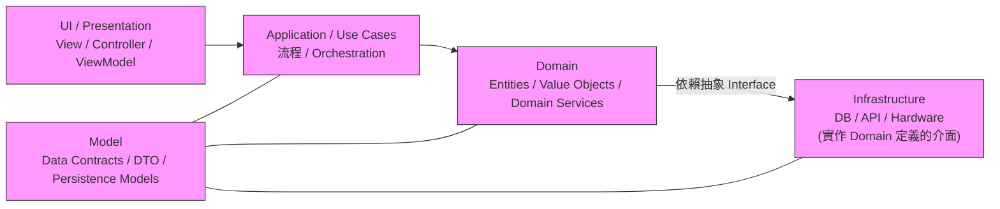

---
{"dg-publish":true,"permalink":"/jet-note/development/ui-app-domain-infrastructure-model/","title":"分層架構完整技術筆記（UI / App / Domain / Infrastructure / Model）","tags":["Development"],"dg-note-properties":{"title":"分層架構完整技術筆記（UI / App / Domain / Infrastructure / Model）","tags":["Development"],"created":"2025-10-03"}}
---


# 分層架構完整技術筆記（UI / App / Domain / Infrastructure / Model）

---

## 🎯 目標

建立一份清晰、可實作、可擴展、可重複使用的軟體架構技術筆記，並結合你的理解：

* UI
* Application（流程/編排）
* Domain（業務邏輯）
* Infrastructure（底層技術）
* Model（資料結構）

輸出包含：

* 圖片風格的架構圖（Mermaid 與示意圖）
* 表格化說明與邊界規範
* C# 專案範本（可直接套用）
* 正式規格文件（分層規範、依賴規則、檢查清單）

---

# 1. 圖片風格架構圖（Mermaid）

下面提供 Mermaid 圖片片段，貼到支援 Mermaid 的 Markdown 編輯器即可呈現。



> 使用方式：將上面的 Mermaid 片段貼入支持 Mermaid 的筆記工具（如 Obsidian、Typora、或專案 README），即可呈現圖片風格架構圖。

---

# 2. 各層責任快速表（精簡）

| 層級                 | 要做什麼                            | 不做什麼             | 依賴方向                    |
| ------------------ | ------------------------------- | ---------------- | ----------------------- |
| **UI**             | 顯示、收輸入、驗證 UI 格式                 | 不做業務規則、不接 DB     | 依賴 App                  |
| **Application**    | 流程編排、交易、錯誤策略                    | 不做商業規則（放 Domain） | 依賴 Domain               |
| **Domain**         | 業務規則、聚合、不變式                     | 不碰技術（DB/IO/HTTP） | 依賴 Interface（抽象）        |
| **Infrastructure** | 實作 Interface、技術整合（DB/外部 API/硬體） | 不包含業務決策          | 實作 Domain 定義的 Interface |
| **Model**          | 資料結構定義（DTO/Entity/VO）           | 不包含業務邏輯          | 被所有層使用                  |

---

# 3. C# 專案範本（一套可直接 Fork 的方案）

專案建議目錄結構：

```
src/
  Api/            # UI 層 (ASP.NET Core Web API / Controllers)
  Application/    # Use Cases, DTOs
  Domain/         # Entities, ValueObjects, Interfaces, Domain Services
  Infrastructure/ # EFCore / Repositories / ExternalAdapters
  SharedModels/   # DTO / Contracts / Mapping Profiles
  Tests/
```

## 3.1 範例 csproj 範本（Api/Api.csproj）

```xml
<Project Sdk="Microsoft.NET.Sdk.Web">
  <PropertyGroup>
    <TargetFramework>net8.0</TargetFramework>
    <Nullable>enable</Nullable>
    <ImplicitUsings>enable</ImplicitUsings>
  </PropertyGroup>

  <ItemGroup>
    <ProjectReference Include="../Application/Application.csproj" />
    <ProjectReference Include="../Domain/Domain.csproj" />
    <ProjectReference Include="../SharedModels/SharedModels.csproj" />
  </ItemGroup>
</Project>
```

> 注意：專案引用採用相對路徑，Windows 與 Unix 都可用。若要發佈成獨立套件，可將 Domain / SharedModels 打包成 NuGet。

---

## 3.2 Domain 範例（介面與實體）

### IOrderRepository

```csharp
namespace MyApp.Domain.Interfaces;

public interface IOrderRepository
{
    Task<Order?> GetByIdAsync(Guid id, CancellationToken ct = default);
    Task SaveAsync(Order order, CancellationToken ct = default);
}
```

### Order（Entity 範例）

```csharp
namespace MyApp.Domain.Entities;

public sealed class Order
{
    public Guid Id { get; private set; }
    public Money Total { get; private set; }
    private readonly List<OrderItem> _items = new();
    public IReadOnlyList<OrderItem> Items => _items.AsReadOnly();

    public Order(IEnumerable<OrderItem> items)
    {
        Id = Guid.NewGuid();
        _items.AddRange(items);
        Recalculate();
    }

    public void ApplyDiscount(decimal percent)
    {
        if (percent <= 0 || percent >= 1) throw new ArgumentException("percent must be 0-1");
        Total = new Money(Total.Amount * (1 - percent), Total.Currency);
    }

    private void Recalculate()
    {
        var sum = _items.Sum(i => i.Price.Amount * i.Quantity);
        Total = new Money(sum, "TWD");
    }
}
```

---

## 3.3 Infrastructure 範例（Repository 實作）

```csharp
namespace MyApp.Infrastructure.Repositories;

public class SqlOrderRepository : IOrderRepository
{
    private readonly AppDbContext _ctx;
    public SqlOrderRepository(AppDbContext ctx) => _ctx = ctx;

    public async Task<Order?> GetByIdAsync(Guid id, CancellationToken ct = default)
    {
        var orm = await _ctx.Orders.Include(o => o.Items).FirstOrDefaultAsync(x => x.Id == id, ct);
        return orm == null ? null : orm.ToDomain(); // mapping extension
    }

    public async Task SaveAsync(Order order, CancellationToken ct = default)
    {
        var orm = order.ToOrm();
        _ctx.Update(orm);
        await _ctx.SaveChangesAsync(ct);
    }
}
```

---

## 3.4 Application Service 範例

```csharp
namespace MyApp.Application.Services;

public class OrderApplicationService
{
    private readonly IOrderRepository _repo;

    public OrderApplicationService(IOrderRepository repo) => _repo = repo;

    public async Task ApplyDiscountAsync(Guid id, decimal percent)
    {
        var order = await _repo.GetByIdAsync(id);
        if (order == null) throw new DomainNotFoundException();
        order.ApplyDiscount(percent);
        await _repo.SaveAsync(order);
    }
}
```

---

## 3.5 Api Controller 範例（UI）

```csharp
namespace MyApp.Api.Controllers;

[ApiController]
[Route("api/orders")]
public class OrdersController : ControllerBase
{
    private readonly OrderApplicationService _svc;
    public OrdersController(OrderApplicationService svc) => _svc = svc;

    [HttpPost("{id}/discount")]
    public async Task<IActionResult> Discount(Guid id, [FromBody] DiscountRequest req)
    {
        await _svc.ApplyDiscountAsync(id, req.Percent);
        return NoContent();
    }
}
```

---

## 3.6 DI 註冊範例（Program.cs）

```csharp
// 註冊 DbContext
builder.Services.AddDbContext<AppDbContext>(opt => opt.UseSqlServer(connStr));

// Domain interfaces implemented by Infrastructure
builder.Services.AddScoped<IOrderRepository, SqlOrderRepository>();

// Application
builder.Services.AddScoped<OrderApplicationService>();
```

---

# 4. 正式規格文件：分層規範（Policy）

## 4.1 依賴規則（必須遵守）

1. 依賴方向：UI -> Application -> Domain -> Interface <- Infrastructure
2. Domain 不依賴 Infrastructure：Domain 只能引用 Domain / SharedModels
3. Infrastructure 只能實作 Interface：Infrastructure 可引用 Domain 的 Interface 定義並實作，但不可把業務邏輯移入 Infrastructure
4. Model（SharedModels）只包含資料結構：禁止把方法/邏輯寫入 DTO

## 4.2 程式碼風格與契約

* Domain 類別應能在不啟動 DB 的情況下做 Unit Test
* Repository 回傳 Domain Entity，而非 ORM DTO
* Mapping 關注點在 Infrastructure（ORM ↔ Domain）

## 4.3 交易與錯誤邊界

* Transaction 應由 Application 控制（Use Case 層）
* Infrastructure 實作應提供必要的回滾能力（由 Application 觸發）
* Domain Exception 應為特定型別（DomainException / NotFoundException）

## 4.4 測試策略

* Domain：純 Unit Tests
* Application：Unit + Integration Tests（透過 Mock or InMemory Repo）
* Infrastructure：Integration Tests（真 DB 或 Testcontainers）
* Api/UI：End-to-end Tests 或 Contract Tests

---

# 5. 邊界檢查清單（PR 檢查用）

* [ ] Domain project references only Domain / SharedModels
* [ ] No direct DbContext usage in Domain
* [ ] Repository returns Domain objects
* [ ] Mapping logic located in Infrastructure
* [ ] Application orchestrates transactions and retries
* [ ] UI does not contain business rules
* [ ] All Domain code has unit tests

---

# 6. 進階補充（Pattern & 實務建議）

### 6.1 常用模式

* Repository Pattern（Interface 在 Domain）
* Unit of Work（由 Application 封裝 Transaction）
* Adapter Pattern（Infrastructure 作為 Adapter 實作）
* Anti-Corruption Layer（當對接外部系統需要保護 Domain 模型時）

### 6.2 實務建議

* 把共享 Model（SharedModels）作成版本化的 Contract 套件
* 把常用工具（TimeoutRunner、RetryPolicy）放在 Infrastructure 或 SharedLib（視是否跨專案）
* 重大變更要寫 Migration 計畫並保留向下相容

---

# 7. 可下載範本（建議步驟）

1. 建 repo skeleton（上述 src 結構）
2. 把 Domain、Application、Infrastructure 各自初始化成獨立 csproj
3. 加入 CI / Pipeline（Build -> Test -> Publish）
4. 建 Dockerfile + SQL Migration step

---

# 8. 結語

已將：

* 圖片風格架構圖（Mermaid 與示意圖）
* C# 專案範本（實作示例、DI、csproj）
* 正式分層規範（Policy）

下一步建議（選一項我會幫你完成）：

* 產生一個 GitHub repo skeleton（含 CI/CD）並把範本放上去
* 匯出為 PDF / PPTX 規格文件
* 製作一張高品質 PNG/SVG 架構圖（可用於簡報）

選一項我就幫你下一步完成。
