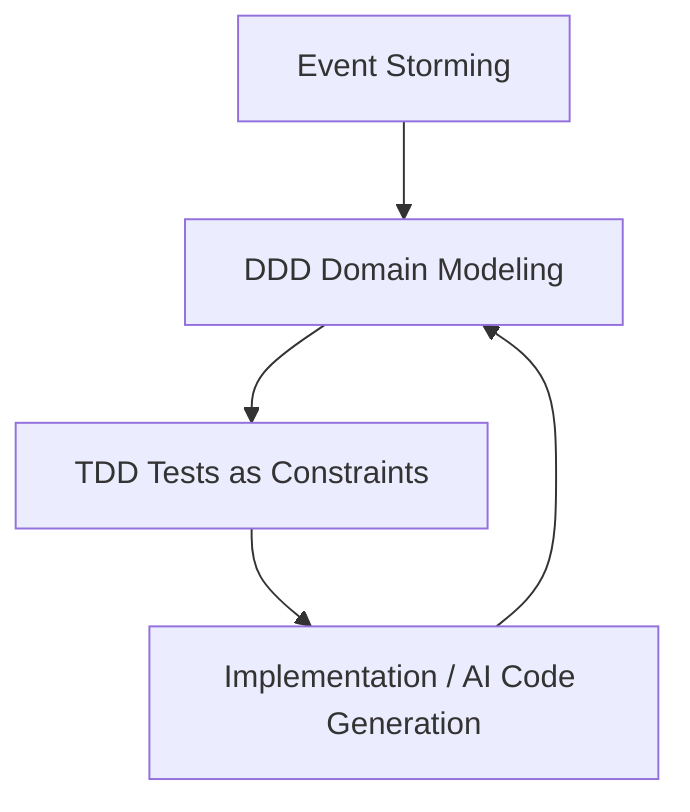
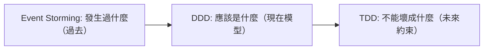
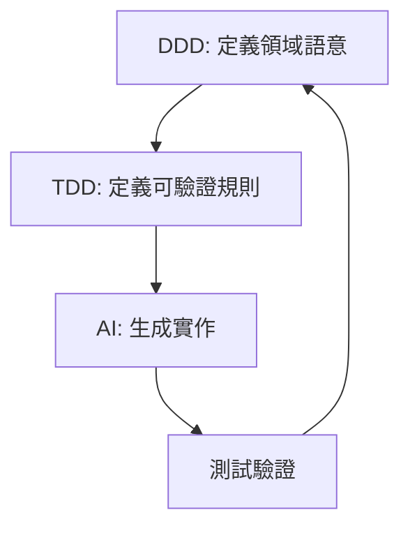
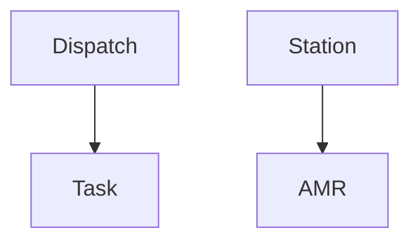
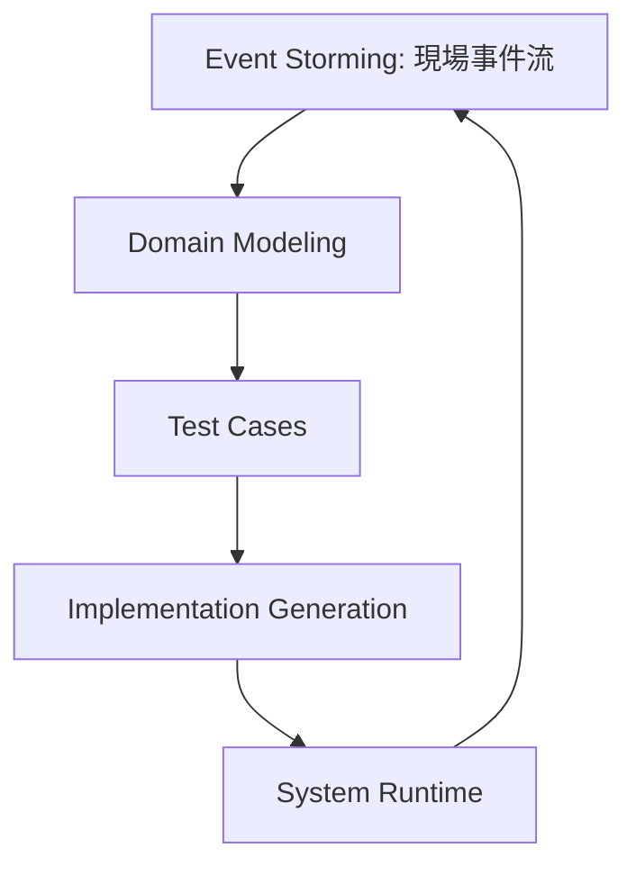

---
{"dg-publish":true,"permalink":"/jet-note/domain-driven-design/ddd-event-storming-tdd-ai/","title":"DDD + Event Storming + TDD + AI 協作筆記","tags":["Domain-Driven-Design","Rule-Driven-Design","EventStorming"],"dg-note-properties":{"title":"DDD + Event Storming + TDD + AI 協作筆記","tags":["Domain-Driven-Design","Rule-Driven-Design","EventStorming"],"created":"2026-05-07"}}
---


# DDD + Event Storming + TDD + AI 協作筆記

---

# 1. 核心概念總覽

現代軟體設計可以抽象成三層結構：

* Event Storming：描述「發生了什麼」
* DDD：定義「系統應該是什麼」
* TDD：約束「系統不能壞成什麼」
* AI：負責「在約束內生成實作」

---

# 2. Event Storming（事件風暴）

## 角色定位

👉 偏向「觀察層 / 現實映射」

## 重點

* 捕捉 Domain Event（領域事件）
* 描述流程時間軸
* 不做抽象設計

## 輸出內容

* Event（事件）
* Command（命令）
* Actor（角色）
* Flow（流程）

## 本質

👉 「發生過什麼」

---

# 3. DDD（Domain-Driven Design）

## 角色定位

👉 偏向「模型層 / 語意結構」

## 重點

* 建立 Domain Model（領域模型）
* 定義 Aggregate（聚合）
* 定義 Entity / Value Object
* 定義 Invariant（不變性）
* 切分 Bounded Context（限界上下文）

## 本質

👉 「系統應該是什麼」

---

# 4. TDD（Test-Driven Development）

## 角色定位

👉 偏向「約束層 / 行為保護」

## 流程

```text
Red → Green → Refactor
```

## 重點

* 用測試定義行為
* 把 Domain Rule 轉為可驗證條件
* 保護系統不被破壞

## 本質

👉 「系統不能變成什麼」

---

# 5. 三者關係（核心架構）



---

# 6. 三層時間觀（非常重要）



---

# 7. 現代 AI 協作開發模型



---

# 8. 實務判斷準則（非常重要）

## ✔ 值得 TDD 的場景

* 業務規則（Business Rule）
* 狀態轉換（State Transition）
* 不變性（Invariant）
* 金流 / 資源控制
* 多流程分歧

## ❌ 不值得 TDD 的場景

* DTO mapping
* CRUD boilerplate
* ORM 查詢
* framework 行為

---

# 9. 三者本質對照

| 層級             | 問題    | 核心   |
| -------------- | ----- | ---- |
| Event Storming | 發生什麼  | 行為流  |
| DDD            | 應該是什麼 | 語意模型 |
| TDD            | 不能壞什麼 | 約束   |

---

# 10. 一句話總結

> Event Storming 描述行為流
> DDD 結構化語意模型
> TDD 鎖定行為約束
> AI 在約束內生成實作

---

# 11. 實戰案例：AMR / Station / Dispatch 系統

以下用你熟悉的物流/機器人場景，把 Event Storming → DDD → TDD 串起來。

---

# 11.1 Event Storming（現場發生什麼）

```text
AMR Arrived at Station A
Station A received vehicle
Station A is occupied
Dispatch requested loading task
Check-in failed (station full)
Vehicle redirected to Station B
Task reassigned
```

👉 重點：純事件流，不談設計

---

# 11.2 DDD（領域建模）

## Entity / Aggregate

* AMR（自動搬運車）
* Station（站點）
* Dispatch（派工系統）
* Task（任務）

## Aggregate Boundary



## Invariant（不變性）

* Station 同時間最多 1 台 AMR（或 N 台，但有 Capacity）
* AMR 不能同時在兩個 Station
* Task 必須綁定唯一 AMR 或處於 Pending

---

# 11.3 TDD（行為約束）

## Station 測試案例

```csharp
[Fact]
public void Station_Should_Reject_When_Capacity_Full()
{
    var station = new Station(capacity: 1);

    station.CheckIn(amr1);
    var result = station.CheckIn(amr2);

    result.IsFailure.Should().BeTrue();
}
```

## Dispatch 測試案例

```csharp
[Fact]
public void Dispatch_Should_Reassign_When_Station_Full()
{
    var dispatch = new Dispatch();

    dispatch.Assign(task, stationA_isFull: true);

    Assert.Equal(StationB, task.AssignedStation);
}
```

---

# 11.4 AI 協作生成（實務用法）

## Input（你提供）

* DDD model（Station / AMR / Task）
* TDD test cases

## AI 負責

* 補 Domain Logic
* 補 State Transition
* 補 Service Implementation

---

# 11.5 完整閉環



---

# 11.6 核心觀察（非常重要）

在 AMR 系統中：

## Event Storming = 現場真實發生

* 車到了
* 站滿了
* 任務轉移

## DDD = 規則抽象

* Station capacity
* Task ownership
* AMR state machine

## TDD = 約束保護

* 不可超載
* 不可雙派工
* 不可狀態跳躍

---

# 11.7 一句話總結 AMR 架構

> Event Storming 找出物流世界的「真實流動」
> DDD 定義 AMR / Station / Dispatch 的「規則世界」
> TDD 鎖住所有「不允許發生的錯誤狀態」
> AI 負責在規則內快速實現系統
