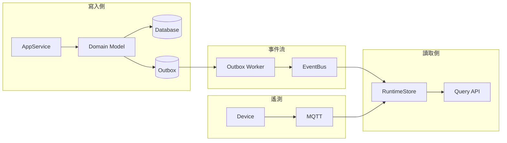

---
{"dg-publish":true,"permalink":"/jet-note/domain-driven-design/ddd-practice/","title":"DDD 實戰架構總結（進階實務版）","tags":["Domain-Driven-Design"],"dg-note-properties":{"title":"DDD 實戰架構總結（進階實務版）","tags":["Domain-Driven-Design"],"created":"2026-05-05"}}
---


# DDD 實戰架構總結（進階實務版）

---

# 一、核心建模策略

## 1. Aggregate Root（聚合根）與生命週期

### Ephemeral Entity（短生命週期實體）

流程：
Rehydrate（從資料庫載入） → Execute（執行業務邏輯） → Persist（持久化） → Dispose（銷毀）

特性：

* 避免應用層共享狀態（Shared State）
* 不依賴記憶體一致性
* 併發控制完全交由資料庫（Database）處理

注意事項：

* 必須搭配 Optimistic Concurrency（樂觀併發控制）
* 否則仍會產生 Race Condition（競態條件）

---

### Long-lived Entity（長生命週期實體）

適用場景：

* Actor Model（演員模型）（如 Orleans、Akka.NET）
* 高互動即時系統（如遊戲伺服器）

風險：

* Transaction Failure（交易失敗）導致狀態污染

實務建議：

* 非必要避免使用
* 優先使用 Ephemeral Model（短生命週期模型）

---

## 2. Aggregate Boundary（聚合邊界）

核心原則：

> 一個 Aggregate = 一個 Transaction Consistency Boundary（交易一致性邊界）

限制：

* 一次交易只允許修改一個 Aggregate
* 跨 Aggregate 溝通必須透過 Domain Event（領域事件）

---

# 二、Domain Event（領域事件）

定義：

* 過去式（Past Tense）的業務事實

設計原則：

* Entity 僅負責產生事件（Event Collection）
* 不直接呼叫 EventBus（事件匯流排）

實作模式：

* 由 Unit of Work（工作單元）在 Transaction Commit 後統一發送

關鍵觀念：

* Domain Event = Eventual Consistency（最終一致性）的起點

---

# 三、交易一致性與併發控制

## 1. Optimistic Concurrency（樂觀併發）

實作方式：

```sql
UPDATE Table
SET ...
WHERE Id = @Id AND Version = @OldVersion
```

若影響筆數為 0：
→ 發生 Concurrency Conflict（併發衝突）

---

## 2. Pessimistic Concurrency（悲觀併發）

方式：

* SELECT ... FOR UPDATE
* WITH (UPDLOCK)

---

## 3. 原子性（Atomicity）

核心原則：

> 狀態變更 + 副作用紀錄 必須在同一個 Transaction 中完成

---

# 四、Outbox Pattern（可靠事件發送）

## 流程

1. 寫入期：

   * Business Table
   * Outbox Table（事件 JSON）
     （同一 Transaction）

2. 提取期：

   * Background Worker（背景服務）掃描 Pending

3. 發送期：

   * 呼叫 EventBus

4. 清理期：

   * 更新為 Published

---

## 關鍵問題：Duplicate Delivery（重複投遞）

原因：

* Worker Crash
* 網路問題
* Retry 機制

對策：

### Idempotency（冪等性）

```sql
ProcessedEvent(EventId UNIQUE)
```

或：

```csharp
if (AlreadyProcessed(eventId)) return;
```

---

# 五、CQRS（命令查詢責任分離）與 Projection（投影）

## RuntimeStore（運行時資料）定位

* 非 Source of Truth（事實來源）
* 屬於 Projection（投影）

更新方式：

* 訂閱 Outbox Event 被動更新

---

## 規則

### Command（寫入）

* 僅依賴 Database（資料庫）
* 不讀取 RuntimeStore

### Query（查詢）

* 僅依賴 RuntimeStore

---

## 資料來源分類

| 類型    | 來源                |
| ----- | ----------------- |
| 強一致驗證 | Database          |
| UI 查詢 | Projection        |
| 弱一致輔助 | Projection（需容忍延遲） |

---

# 六、選型原則（核心補強）

## 1. Telemetry Data（遙測數據）

特性：

* 高頻
* 非關鍵業務決策
* 可容忍延遲與遺失

架構：

* 非同步（Asynchronous）
* 弱一致性（Weak Consistency）
* 高效快取（High Performance Cache）

流程：
MQTT → RuntimeStore

---

## 2. Lifecycle / Task Data（生命週期 / 任務數據）

特性：

* 關鍵業務狀態
* 必須可回溯
* 不可遺失

架構：

* 同步（Synchronous）
* 強一致性（Strong Consistency）
* 交易保證（Transactional）

流程：
AppService → Database + Outbox

---

# 七、State Alignment（狀態對齊機制）

核心概念：

> 系統需具備「由實向虛」的對齊能力

定義：

* Database（資料庫）為最終事實來源（Source of Truth）
* RuntimeStore 為投影（Projection）

---

## 問題場景

* RuntimeStore 遺失（Memory Reset / Crash）
* MQTT 訊息遺失

---

## 解法流程

1. 讀取 Database 中 Job 狀態（真實狀態）
2. 判斷應有的物理狀態
3. 主動向設備發送請求（Request Device Sync）
4. 透過 MQTT 重新接收現況
5. 重建 RuntimeStore

---

## 本質

* Projection 可重建
* 真相不可遺失

---

# 八、架構總覽（Mermaid）



---

# 九、進階檢查清單（Senior Checklist）

* Idempotency（冪等性）是否完整
* Outbox 是否可追溯（Replay）
* Domain 是否與 Persistence（持久化）解耦
* 非核心失敗是否隔離（Failure Isolation）
* Projection 是否可重建
* 是否明確區分 Telemetry 與 Lifecycle Data

---

# 十、核心總結

1. Database = Source of Truth（唯一事實來源）
2. RuntimeStore = Projection（投影）
3. Outbox = 保證事件不遺失（但可能重複）
4. Event = 最終一致性的媒介
5. 系統必須可從 DB 重建整體狀態（Recoverability）

---

# 十一、一句話版本

> 用 Database 保證真實，用 Event 傳播變化，用 Projection 提供速度，用對齊機制確保系統不會偏離現實
