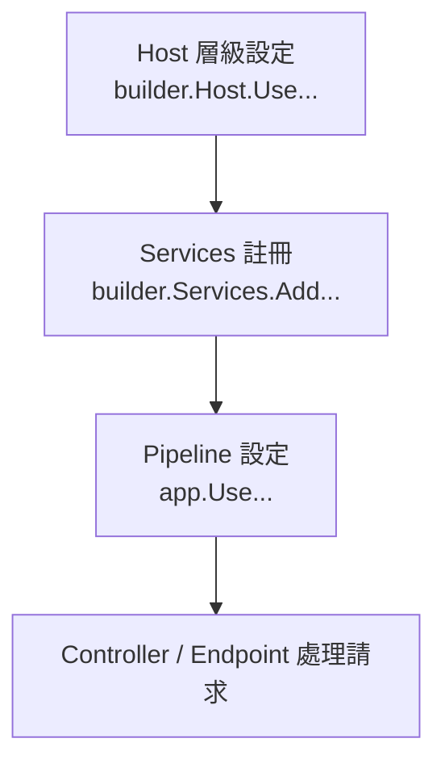
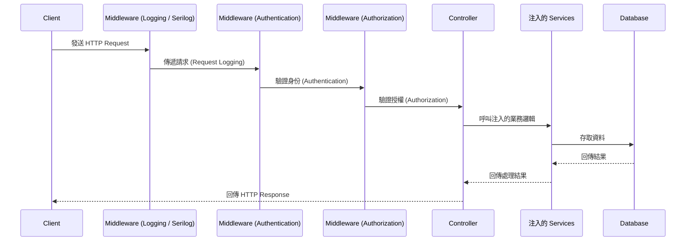

---
{"dg-publish":true,"permalink":"/jet-note/dotnet/asp-net-core-services-pipeline/","title":"📘 ASP.NET Core Services 與 Pipeline 筆記 (完整版 + 請求流動圖 + 最佳實務)","tags":[".Net"],"dg-note-properties":{"title":"📘 ASP.NET Core Services 與 Pipeline 筆記 (完整版 + 請求流動圖 + 最佳實務)","tags":[".Net"],"created":"2025-09-11"}}
---


# 📘 ASP.NET Core Services 與 Pipeline 筆記 (完整版 + 請求流動圖 + 最佳實務)

## 1. 基本概念

ASP.NET Core 啟動流程可分為三個層級：

1. **Host 層級設定**

   * 在應用程式啟動前就生效的設定。
   * 決定整個 Host 的行為，例如 Logging、Kestrel 設定。
   * 寫法：`builder.Host.Use...`

2. **Services (依賴注入容器)**

   * 應用程式內部需要用到的功能（例如資料庫、業務邏輯、第三方 API 客戶端）。
   * 註冊進 **DI 容器**，在 Controller、BackgroundService、Handler 中可透過建構函式注入。
   * 寫法：`builder.Services.Add...`

3. **Pipeline (中介軟體管線)**

   * 定義 HTTP 請求的處理流程。
   * 每個請求會依序經過 Pipeline 中的中介軟體 (Middleware)，最後才交給 Controller/Endpoint 處理。
   * 寫法：`app.Use...`

---

## 2. 常見程式碼範例

```csharp
var builder = WebApplication.CreateBuilder(args);

// 1️⃣ Host 層級 (應用程式啟動前就生效)
builder.Host.UseSerilog();

// 2️⃣ Services (依賴注入容器)
builder.Services.AddDbContext<AppDbContext>();
builder.Services.AddScoped<IMyService, MyService>();
builder.Services.AddHttpClient();

// 3️⃣ Pipeline (HTTP 請求處理流程)
var app = builder.Build();

app.UseSerilogRequestLogging();
app.UseAuthentication();
app.UseAuthorization();
app.MapControllers();

app.Run();
```

---

## 3. Services vs Pipeline vs Host 對照表

| 分類                    | 定義                                    | 註冊位置                      | 範例                                                                                                       | 適用場景                                                            |
| --------------------- | ------------------------------------- | ------------------------- | -------------------------------------------------------------------------------------------------------- | --------------------------------------------------------------- |
| **Services (依賴注入容器)** | 可被注入並在應用程式中使用的物件或功能。                  | `builder.Services.Add...` | `builder.Services.AddDbContext<AppDbContext>()`<br>`builder.Services.AddScoped<IMyService, MyService>()` | - 資料庫連線<br>- 業務邏輯服務<br>- 第三方 API 客戶端<br>- Caching、Configuration |
| **Pipeline (中介軟體)**   | 定義 **HTTP 請求處理流程**，依序經過各個 Middleware。 | `app.Use...`              | `app.UseAuthentication()`<br>`app.UseAuthorization()`<br>`app.UseSerilogRequestLogging()`                | - 請求驗證與授權<br>- Logging<br>- Routing<br>- 錯誤處理<br>- CORS         |
| **Host 層級設定**         | 在應用程式啟動前就生效的全域設定。                     | `builder.Host.Use...`     | `builder.Host.UseSerilog()`                                                                              | - 全域 Logging (Serilog、NLog)<br>- Kestrel 設定<br>- Hosting 環境     |

---

## 4. 心智模型

* **Services** → 「工具箱」：把需要的工具先放進 DI 容器，之後各處可取用。
* **Pipeline** → 「安檢流程」：每個請求進來必須經過這些檢查與處理。
* **Host 層級** → 「全域規則」：在 App 啟動之前就決定好，影響整體行為。

---

## 5. 啟動流程



---

## 6. HTTP Request 流動路徑



---

## 7. 最佳實務建議 (Best Practices)

### 🔹 Services 註冊策略

* **Transient**：每次注入都建立新實例
  👉 適合 **無狀態的輕量邏輯** (Helper、計算器)。
* **Scoped**：每個 **Request** 共用一個實例
  👉 適合 **資料庫 Context、業務邏輯**。
* **Singleton**：整個應用程式只建立一次
  👉 適合 **設定值、快取、長連線物件** (例如 HttpClientFactory)。

---

### 🔹 Pipeline 建議順序

1. **Exception Handling** (`UseExceptionHandler`)
2. **Request Logging** (`UseSerilogRequestLogging`)
3. **Routing** (`UseRouting`)
4. **CORS** (`UseCors`)
5. **Authentication** (`UseAuthentication`)
6. **Authorization** (`UseAuthorization`)
7. **Endpoints / Controllers** (`MapControllers`)

---

### 🔹 Host 層級設定

* Logging：建議用 `Serilog` / `NLog` 取代內建 Logging，便於集中化管理。
* Kestrel：根據部署環境調整 Port、限制請求大小、HTTPS 設定。
* Configuration：建議結合 `appsettings.json` + 環境變數，避免硬編碼。

---
