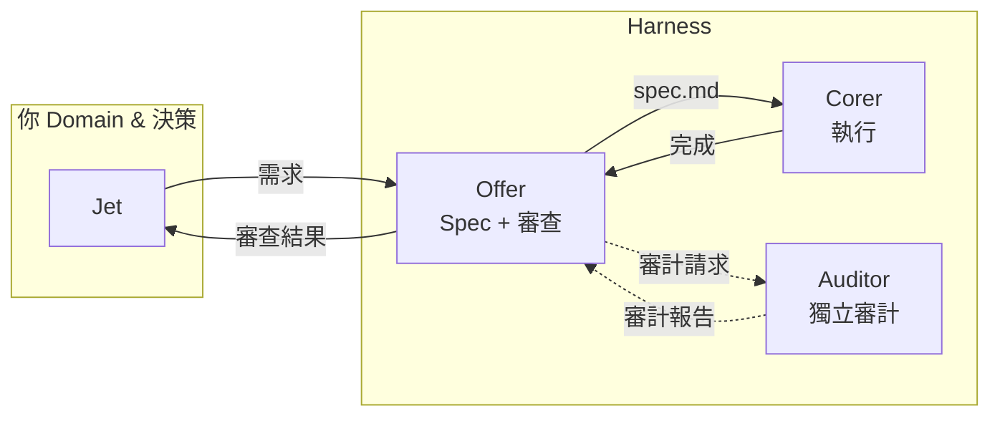

---
{"dg-publish":true,"permalink":"/jet-note/harness/ai-collab-paradigm/","title":"AI 協作範式筆記","tags":["AiSoul","Workflow","Paradigm"],"dg-note-properties":{"title":"AI 協作範式筆記","tags":["AiSoul","Workflow","Paradigm"],"created":"2026-06-09","updated":"2026-06-09"}}
---

# AI 協作範式筆記

這份筆記記錄 Offer 與 Jet 對目前 AI 協作模式的理解共識。它不是操作手冊（操作見 [[專案生命週期 Pipeline\|專案生命週期 Pipeline]] 與 agent-contract skill），而是對「我們在做什麼、這是什麼層級的東西」的定位文件。

---

## 一、核心命題

> **我們建立的不是 Workflow（工作流程），而是 Harness（駕馭工程）。**

- **Workflow** 規定 Agent 要走的步驟先後。
- **Harness** 是道路兩側的鋼筋護欄與自動導正系統——用強型別、編譯器、測試鏈作為硬約束，讓 AI 即使想亂走也走不出去。

兩者的本質差異：

| 維度 | Workflow | Harness |
|------|----------|---------|
| 控制方式 | 告訴 AI「你要這樣做」 | 讓環境不允許 AI 那樣做 |
| 出錯反應 | 等人發現、等人 prompt 修正 | 編譯器/測試自動阻斷，回饋閉環 |
| 正確率來源 | 大模型的判斷力（機率） | 型別系統 + 測試鏈（確定性） |
| 範例 | 「請先寫測試再寫 code」 | `dotnet build` 不過就不能 complete |

---

## 二、已實作的 Harness 元件

### 2.1 型別信任門禁（Type-Level Contract）

| 元件 | 作用 | 狀態 |
|------|------|------|
| C# Interface 定義 API 合約 | AI 不能發明簽章，被型別鎖死 | ✅ 已實作（FastEndpoints + DDD） |
| spec.md 規格書 | 定義業務邏輯邊界與不做範圍 | ✅ 已實作（Corer 唯一依據） |
| Mermaid 流程圖 | 人類可視化驗證流程正確性 | ✅ 已實作（人看文件標準格式） |

**缺口：** 目前的 spec 仍是 markdown，不是 type-level spec。業務邏輯條件（「當庫存不足時回傳 400」）尚未被型別系統約束。

### 2.2 測試先行自動導航（TDD-Driven）

| 元件 | 作用 | 狀態 |
|------|------|------|
| TDD 三模式（規格先行/補強/混合） | 測試在 code 之前存在 | ✅ 已實作（Pipeline doc） |
| Test → Corer 的依賴順序 | Corer 執行前必須有 test | ✅ 已實作 |
| Acceptance Criteria 對照 test | 確保測試涵蓋 spec | ✅ 已實作 |

**缺口：** 目前 test 的紅燈由 Offer 確認後才派工，尚未全自動。

### 2.3 四維審查閘道（Review Gate）

| 維度 | 檢查項 | 狀態 |
|------|--------|------|
| Build | `dotnet build` 獨立執行 | ✅ 已實作，強制執行 |
| Test | `dotnet test` 獨立執行，不採信 Corer 自報 | ✅ 已實作（真實案例：Corer 報 0 error 但 Services/ 殘留舊 namespace 導致 build 6 errors） |
| Structure | namespace 殘留、目錄完整性 | ✅ 已實作（RFIDMappingService R3 結構檢查） |
| Run | 服務啟動 + smoke test | ✅ 已實作 |

**缺口：** 目前由 Offer 手動執行，尚未 script 化為自動閉環。

### 2.4 獨立審計（Auditor Gate）

| 元件 | 作用 | 狀態 |
|------|------|------|
| Auditor profile（stock-strategy-auditor） | 獨立第三方審查設計決策 | ✅ 已實作（手動呼叫） |
| Cross-profile 通訊協議 | Offer ↔ Auditor 透過 Obsidian 交換意見 | ✅ 已實作 |
| 審計修復計畫格式 | 結構化修復 task 供 Jet 逐項確認 | ✅ 已實作 |

**缺口：** Auditor 尚未整合進 Kanban 自動化 pipeline，目前需 Jet 手動切 profile。

---

## 三、目前 Pipeline 全景

**你在 pipeline 中的位置：**
- 輸入：需求（案件描述 / domain 決策）
- 輸出：成品驗收
- 中間不需要介入，除非遇到 domain 模糊或審計 edge case

---

## 四、與傳統 Prompt Engineering 的差異

| 維度 | 傳統 Prompt Engineering | 本 Harness 範式 |
|------|------------------------|----------------|
| 核心控制手段 | 文字指令的精準度 | 型別 + 編譯器 + 測試鏈 |
| 出錯反應 | 人類讀 log → 改 prompt → 重跑 | 編譯器阻斷 / test 紅燈 → AI 自動修正 |
| 正確率來源 | LLM 的機率分佈 | 編譯器 100% 確定性 + 測試覆蓋率 |
| 可重複性 | 同一 prompt 每次結果不同 | 同一 spec 每次通過相同測試 |
| 規模化方式 | 更長的 context + 更多的 few-shot | 更嚴的型別 + 更完整的測試套件 |

---

## 五、當前狀態 vs 終極目標

| 項目 | 當前狀態（2026-06） | 終極目標 |
|------|-------------------|---------|
| Spec 載體 | Markdown（spec.md） | 結構化 spec（spec.json / type-level） |
| 審查方式 | Offer 手動執行 4D review | 自動化審查 script（Execute_Dotnet_Pipeline） |
| 出錯閉環 | Offer 判斷後 reopen task 或手動修 | Error log 自動餵回 AI，自我修復到綠燈 |
| 人類參與度 | 需確認 spec、紅燈原因、domain 決策 | 只看 Mermaid + Interface，說 OK |
| 審計整合 | 手動切 profile | Kanban 自動觸發 Auditor task |

---

## 六、演化路徑（多做專案，自然長出來）

Harness 不是一次大爆炸設計出來的，是從真實案例中 extraction 出來的。每完成一次完整 pipeline：

1. **專案數量增加** → spec.md 越寫越結構化 → 半自動生成成為可能
2. **重複模式固化** → 審查 checklist 越跑越固定 → script 化成為自然
3. **測試套件累積** → test failure 可直接驅動修復流程
4. **信任感建立** → Jet 需要介入的次數自然減少
5. **AI 對 domain 的理解加深** → spec 品質提升、修正次數下降

**最快的方法是多做，沒有捷徑。**

---

## 七、相關文件

- [[專案生命週期 Pipeline]] — 七階段操作流程（需求 → 歸檔）
- `~/.hermes/skills/agent-contract/` — Offer ↔ Corer 協作合約（Kanban 流程、審計協議、Scope 變更協定）
- `program/` (Obsidian) — 各專案的規格、架構、ADR 與歸檔文件
- `areas/developer-notes/` — 開發經驗記錄
