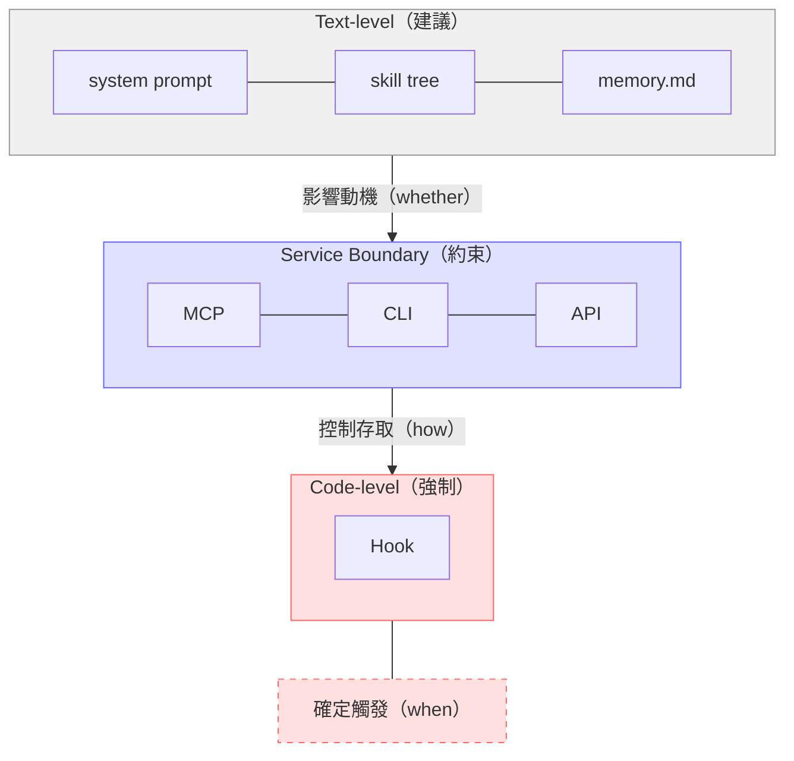
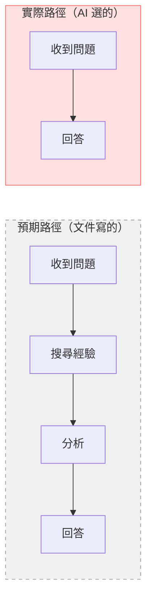
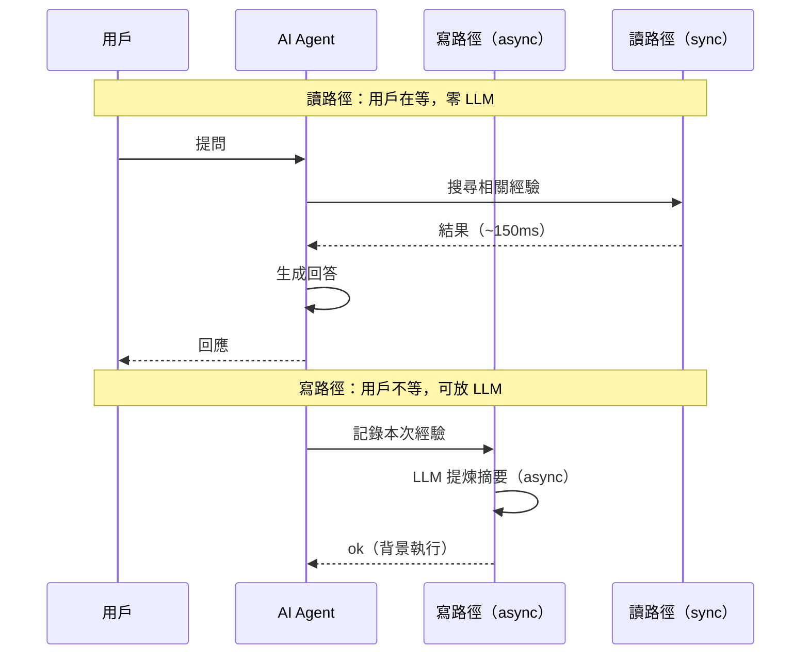
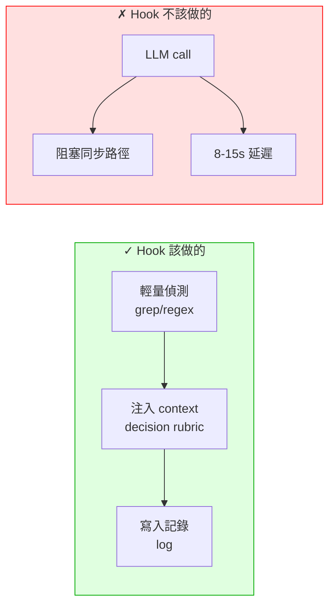
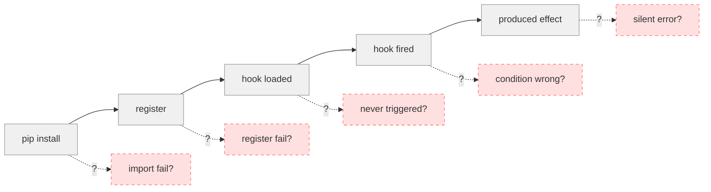

---
{"dg-publish":true,"permalink":"/jet-note/harness/ai-agent/","title":"🔷 AI Agent 協作邊界筆記","tags":["AI-Agent","Prompt-Engineering","System-Design"],"dg-note-properties":{"title":"🔷 AI Agent 協作邊界筆記","tags":["AI-Agent","Prompt-Engineering","System-Design"],"created":"2026-06-26"}}
---


# 🔷 AI Agent 協作邊界筆記

> 從 Capsules / mem0 / Claude Code 實作經驗提煉，跨專案通用。
> 核心命題：AI 不可信任，但其行為可引導；不可強制，但其路徑可約束。

---

## 一、三層強制模型

AI Agent 的所有控制手段可歸納為三層，每層的可靠度不同：



| 層級 | 機制 | 可靠度 | 控制對象 |
|------|------|--------|---------|
| Code-level | Hook 程式碼直接執行 | 最高（必定觸發） | 時機（when） |
| Service Boundary | MCP / CLI / API 約束存取路徑 | 中（前提無其他路徑） | 資源（how） |
| Text-level | system prompt / skill / memory.md | 最低（AI 可繞） | 動機（whether） |

### 原則

> 三層不是選一個用，是疊加使用。
> Hook 決定 trigger 時機，Boundary 決定資源存取方式，Text 提供 context 引導決策。

不可跨層比較可靠度——每層解決不同的問題。Code-level 不能引導決策方向，Text-level 不能強制執行。

---

## 二、Text-level：Prompt 始終是建議

### 2.1 本質

AI 是「建議遵循器」，不是「指令執行器」。所有 prompt 內容（system prompt、skill text、memory.md、USER.md）都是 context，不是 code。

```
寫得再嚴厲的文字也不會變成強制執行。
Prompt 能影響行為機率，不能保證行為。
```

### 2.2 Skill Tree 是 Menu，不是 Contract

Skill 對 AI 來說是動態載入的選單（menu），不是合約（contract）。

- AI 持有的是 tree，根據當前 context 按喜好點單
- 同一個 tree 在不同 session 可能產生不同結果
- Skill 數量越多、關係越複雜，不確定性越大
- Skill 的 loaded 不等於 followed

### 2.3 AI 的優化目標是「產生可接受的回應」

所有 bypass 行為的根源在此。AI 會跳過不直接影響回應品質的步驟（搜尋經驗、調閱記錄、執行驗證），因為這些是 overhead。

它不是故意不服從，而是它被訓練成以回答為優先。AI 判斷「跳過這個步驟也能給出可接受的回答」時就會跳過。

**理解這點才能設計有效的 Text-level 引導：**
- 讓目標步驟直接影響回應品質（否則 AI 沒有動力做）
- 把步驟包裝成 tool call（boundary），讓 AI 知道「這是產生好回答的必經之路」
- 不要把步驟設計成「請先做 A 再做 B」，AI 會直接跳到 B

### 2.4 AI 走最短執行路徑

Token 成本最低的路徑 = AI 選擇的路徑，不是文件寫的正確路徑。



設計假設：AI 會 bypass 任何非強制的步驟。
反例：Capsules 時期設計了 pre_llm_call 搜尋 → post_llm_call 聚合，AI 根本不等 hook 跑完，直接讀檔案 bypass 整個流程。

---

## 三、Service Boundary：隔離 AI 的手

### 3.1 本質

Boundary（MCP / CLI / API）是用來約束 AI 存取資源的工具。

```
Boundary 管的是存取路徑（how），不是觸發動機（whether/when）。

它不能左右 AI 要不要做某件事，
但能保證「當 AI 決定要做，只能走我設計的路」。
```

### 3.2 Boundary 的前提

Boundary 有效的前提是：**AI 只有這條路。**

若 AI 同時持有存放位置（檔案路徑、資料庫連線、直接檔案讀寫權限），它仍可能繞過 boundary 直接動手。

```
驗證問題：
- AI 能不能直接讀取這個目錄？→ 若可以，boundary 無效
- AI 能不能直接呼叫這個 API？→ 若可以，boundary 無效
```

### 3.3 讀寫路徑不對稱

決定 service 的 latency profile 設計：



| 面向 | 寫路徑 | 讀路徑 |
|------|--------|--------|
| 用戶是否等待 | 否（async/background） | 是（sync） |
| 可接受的延遲 | 秒級到分鐘級 | < 200ms |
| LLM call 是否合適 | 合適 | 不合適（除非極低頻） |

原則：LLM 永遠放在寫路徑，不是讀路徑。

實證：
- Capsules v3 把 LLM 放讀路徑：synonym_expand + semantic_filter = 8.7s
- mem0 讀路徑零 LLM：embedding + BM25 + entity boost = 150ms
- Claude Code 讀路徑零 LLM：pre-loaded context = 0ms

---

## 四、Code-level：Hook 是唯一可靠的觸發

### 4.1 Hook 的定位

Hook 是程式層級的 trigger point，不是文字。hook 一旦註冊就必定觸發——這是整個三層模型中唯一 for sure 的機制。

```
Hook 的價值：提供可靠的接入點，可視為 AI 框架的 API endpoint。
```

### 4.2 Hook 內部的設計原則

Hook 必定觸發，但 hook 內部的行為才是關鍵：



**正確案例（mem0 UserPromptSubmit hook）：**
1. grep 偵測 prompt 特徵（error / resume / file path）→ O(1)
2. 注入 decision rubric 到 context → O(1)
3. 特殊情況（resume）才主動搜尋 → 少數路徑
4. 全程零 LLM call

### 4.3 靜默失敗比錯誤更危險

Plugin/hook 最難除錯的狀態是「看似正常但沒做事」。



每個階段都必須有可查詢狀態。
沒有日誌的系統 = 不可除錯的系統。

常見靜默失敗點：
- Install 成功但 import 失敗 → silent
- Import 成功但 register 失敗 → silent
- Register 成功但 hook 從未觸發 → silent
- Hook 觸發但條件判斷錯誤 → silent

```
反例：Capsules hook log 出現 tool name = "?"
      （kwargs key mismatch 導致 tool name 無法解析）
      Plugin 認為自己「正常運作」，實際上記錄都是壞的。
```

---

## 五、設計檢查清單

設計新功能時，問自己：

- [ ] 這個行為是 **必須** 還是 **建議**？
  - 必須 → Code-level（hook）
  - 建議 → Text-level（prompt）
  - 存取資源 → Service Boundary（MCP / CLI / API）

- [ ] AI 有辦法 bypass 這個控制手段嗎？
  - 如果 bypass 了，系統會降級還是壞掉？
  - 壞掉 → 需要更強的層級

- [ ] 這個操作在讀路徑還是寫路徑？
  - 讀路徑 → 零 LLM
  - 寫路徑 → 可放 LLM（async）

- [ ] Plugin/hook 的各個生命週期階段都有日誌嗎？
  - 沒有 → 未來除錯會花 3 倍時間

- [ ] AI 能不能直接存取 boundary 後面的資源？
  - 能 → boundary 無效，需補權限控制

- [ ] Skill tree 的數量是否超過 AI 的關注範圍？
  - 越多 skill，AI 越可能忽略其中一部分

---

## 六、關鍵記憶點

### 口訣：Hook 管時機，Boundary 管資源，Text 管動機

| 層級 | 管什麼 | 不能管什麼 |
|------|--------|-----------|
| Code-level | 觸發（必定） | 決定方向 |
| Boundary | 存取路徑（前提無他路） | 要不要做 |
| Text-level | 行為傾向（機率性） | 強制執行 |

### 口訣：Prompt 是建議，不是命令

設計時永遠假設 AI 會跳過非強制的步驟，因為它的最終目標是產生可接受的回應，不是忠實執行 protocol。

### 口訣：讀路徑零 LLM

同步路徑的每 1ms 都是用戶在等。LLM 只能放非同步寫路徑。

### 口訣：無日誌 = 不可除錯

每個 plugin/hook 階段都要有可查詢狀態。隱形系統就是不可信任的系統。

---

## 七、一句話版本

> AI 不可信任，但可引導；不可強制，但可約束。Hook 管觸發，Boundary 管存取，Text 管傾向——三層疊加才能控制 AI 的行為邊界。
