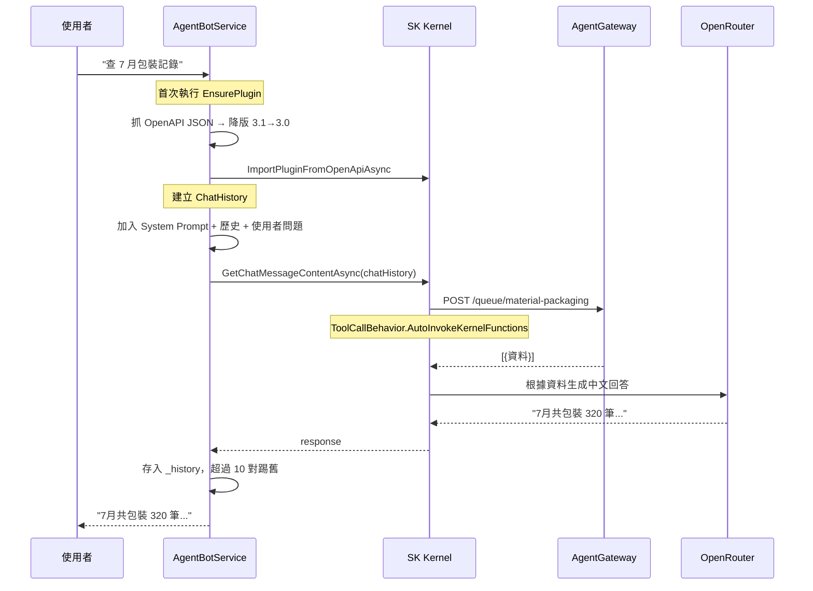

---
{"dg-publish":true,"permalink":"/jet-note/projects/ai/agent-gateway-agent-bot/","title":"AgentGateway + AgentBot — 第一個 AI 整合專案技術筆記","tags":["AI","Agent","Semantic-Kernel","OpenAPI","Blazor","DotNet"],"dg-note-properties":{"title":"AgentGateway + AgentBot — 第一個 AI 整合專案技術筆記","tags":["AI","Agent","Semantic-Kernel","OpenAPI","Blazor","DotNet"],"created":"2026-07-17","updated":"2026-07-17"}}
---


# AgentGateway + AgentBot — 第一個 AI 整合專案技術筆記

> 這是我的第一個成功串接 Semantic Kernel + OpenAPI plugin 的 AI 專案。
> 從一個簡單的查詢需求開始，逐步打通從 AI 對話到 SQL 資料庫的整條鏈路。
> 記錄技術架構、設計決策與踩坑經驗，方便後續檢視。

---

## 專案定位

```
使用者 ──自然語言──► AgentBot ──HTTP/JSON──► AgentGateway ──Dapper──► SQL 生產資料庫
                        │                           │
                  Semantic Kernel                 FastEndpoints
                  OpenRouter API               OpenAPI 3.1 spec
```

| 專案 | 角色 | 技術 |
|------|------|------|
| `AgentGateway.ImplApi` | **API Gateway** — 提供工廠資料查詢 REST API | FastEndpoints + Dapper + Serilog |
| `AgentBot.iMPL` | **Bot** — 讓使用者以自然語言查資料 | Blazor Server + SK + OpenRouter |

---

## 一、為什麼先做 Gateway 而不是直接 Bot

當時的核心需求是「讓 AI 能查 DB」。但直接讓 AI 連 DB 太危險（SQL injection、沒權限控管），所以決定在中間加一層 API Gateway：

```
不安全：AI ──SQL──► DB
安全：   AI ──API──► Gateway ──參數化SQL──► DB
```

Gateway 的好處：
- 只開放讀取（`WITH (NOLOCK)`），不開放寫入
- 驗證透過白名單欄位 + Dapper 參數化查詢
- API endpoint 就是 AI 的工具，規格清楚

---

## 二、AgentGateway.ImplApi — API 層

### 技術棧

| 項目 | 選擇 | 版本 |
|------|------|------|
| 框架 | ASP.NET Core | net10.0 |
| API 路由 | FastEndpoints | 8.2.0 |
| API 文件 | FastEndpoints.OpenApi | 8.2.0（OpenAPI 3.1） |
| Swagger UI | Swashbuckle.SwaggerUI | 10.2.3 |
| ORM | Dapper | 2.1.79 |
| DB 驅動 | Microsoft.Data.SqlClient | 7.0.2 |
| 日誌 | Serilog.AspNetCore | 10.0.0 |
| 連線字串管理 | 外部 JSON 檔（gitignored） | — |

### 提供的 API

| 路由 | 名稱 | 用途 |
|------|------|------|
| `GET /health` | HealthCheck | 存活檢查 |
| `POST /queue/material-packaging` | QueryMaterialPackaging | 物料包裝佇列查詢 |
| `POST /queue/pallet-to-shipping` | QueryPalletToShipping | 出貨棧板佇列查詢 |
| `POST /worktime` | QueryWorkTime | 人員工時記錄查詢 |

### 設計特點

**1. 動態 WHERE 組建 (`BuildWhere`)**

每個查詢 DTO 有 5~14 個可選欄位，使用者不傳就不加入 WHERE，完全動態：

```csharp
var (where, parameters) = DbService.BuildWhere(
    (nameof(req.ProductNumber), req.ProductNumber),  // 有值 WHERE ProductNumber = @p0
    (nameof(req.WorkOrderNumber), req.WorkOrderNumber) // 有值再加 AND WorkOrderNumber = @p1
    // null 的欄位自動跳過
);
```

**2. 時間範圍 (`AddTimeRange`)**

每個 DTO 有 `XxxTimeFrom` / `XxxTimeTo`，組出類似 `WHERE QueueTime >= @t1 AND QueueTime < @t2`。

**3. 欄位篩選 (`Fields` + `ParseFields`)**

AI 可以指定只要哪些欄位回傳（`Fields=ProductNumber,WorkOrderNumber`），減少資料量。`ParseFields` 只放行白名單內的欄位，擋 SQL injection：

```csharp
var fields = DbService.ParseFields(req.Fields, AllowedColumns);
// 有 Fields → QueryDynamicAsync (SELECT 指定欄位)
// 無 Fields → QueryTableWithNoLockAsync (SELECT *)
```

**4. 強制 NOLOCK**

所有查詢一律 `WITH (NOLOCK)`，避免生產環境的寫入鎖影響讀取。

**5. 翻頁 (Skip / Take)**

用 SQL Server `OFFSET / FETCH NEXT`，讓 AI 自己決定頁數。

### Property 描述注入

OpenAPI 的 schema property 需要有 `description` 才會讓 SK 看到參數說明。但 .NET 10 的 OpenAPI 生成器不會自動讀 `/// <summary>` XML comment。解法：

```
/// <summary>產品料號</summary>      → 不會進 OpenAPI JSON ❌
[Description("產品料號")]           → 會進 OpenAPI JSON ✅
```

所以在每個 DTO property 上加 `[Description]` 屬性。

---

## 三、AgentBot.iMPL — Bot 層

### 技術棧

| 項目 | 選擇 | 版本 |
|------|------|------|
| 框架 | Blazor Web App (Server) | net10.0 |
| AI 引擎 | Semantic Kernel | 1.78.0 |
| LLM Provider | OpenRouter | — |
| 模型 | deepseek/deepseek-v4-flash | — |
| 對話記憶 | SK ChatHistory | 正統多輪模式 |
| 日誌 | Serilog.AspNetCore | 10.0.0 |
| 外部設定 | JSON 檔外掛（gitignored） | — |

### 核心流程



### 多輪對話記憶

使用 SK 正統 `ChatHistory` + `IChatCompletionService`，與 LangChain 的 `ConversationBufferMemory` 概念相同：

```csharp
var chat = new ChatHistory();
chat.AddSystemMessage(systemPrompt);           // 系統角色設定
foreach (var (user, assistant) in _history) {  // 歷史對話
    chat.AddUserMessage(user);
    chat.AddAssistantMessage(assistant);
}
chat.AddUserMessage(userMessage);              // 當前問題

var result = await chatService.GetChatMessageContentAsync(chat, settings, _kernel, ct);
```

| LangChain 概念 | SK 對應 |
|----------------|---------|
| `ConversationBufferMemory` | `ChatHistory` |
| `add_user_message` | `AddUserMessage` |
| `add_ai_message` | `AddAssistantMessage` |
| `RunnableWithMessageHistory` | 手動注入 ChatHistory |
| `Tool` | `KernelPlugin` (OpenAPI plugin) |
| `AgentExecutor` | `Kernel` + `ToolCallBehavior.AutoInvokeKernelFunctions` |

### System Prompt 結構

每次請求都會帶這些規則，引導 AI 行為：

```
# Role                    → 角色定位
# Context                 → 當前時間等環境資訊
# Conversation History    → 多輪對話記錄（上限 10 輪）
# Constrains              → 回應要精簡、精準過濾、錯誤回報
# Date Process Rules      → 相對時間→絕對日期（今天、上個月、7月）
# Output Format Rules     → 對比用表格、彙總模式調用 3 個 function
# Default Value Rules     → 未指定時間→當天，未指定產線→全產線
```

### System Prompt 經驗

```
第一次（太簡略）：AI 問「你需要查什麼？」
第二次（加規則）：AI 直接回答但撈全部資料再做分析
第三次（加過濾規則 + 範例）：AI 學會用參數篩選
第四次（加彙總規則）：AI 會同時調用多個 function
```

---

## 四、踩坑記錄

### 坑 1：連線被切斷（Response ended prematurely）

**現象**：Bot 呼叫 Gateway 時噴 `System.Net.Http.HttpIOException: The response ended prematurely.`

**原因**：連線 port 錯誤。`appsettings.json` 設的是 `http://localhost:7087`，但 7087 是 **HTTPS** port，Bot 用 `http://` 打 HTTPS port，Kestrel 直接切斷連線。

**解法**：改成 `http://localhost:5187`（HTTP port）。

### 坑 2：OpenAPI 3.1 不相容

**現象**：SK 的 `ImportPluginFromOpenApiAsync` 噴 `Cannot create a scalar value from this type of node.`

**原因**：FastEndpoints.OpenApi 輸出 **OpenAPI 3.1**（`"type": ["string", "null"]`陣列語法），但 SK 1.x 只認 **OpenAPI 3.0**（`"type": "string"` + `nullable: true`）。

**解法**：手動抓 JSON → 降版轉換 3.1→3.0 → 餵 Stream 給 SK。

```csharp
// 轉換前
"type": ["null", "integer"]

// 轉換後
"type": "integer",
"nullable": true
```

### 坑 3：SK 拒絕 HTTP 網址

**現象**：`The request URI scheme 'http' is not allowed. Only 'https' is permitted by default.`

**原因**：SK 的 OpenAPI plugin 預設只允許 HTTPS。

**解法**：在 `OpenApiFunctionExecutionParameters` 設定 `ServerUrlValidationOptions.AllowedBaseUrls` + `ServerUrlOverride`。此 API 標示為 `[Experimental]`（SKEXP0040），需用 `#pragma warning disable SKEXP0040` 抑制。

### 坑 4：Dapper 不支援 IDictionary 泛型

**現象**：`Invalid type owner for DynamicMethod`

**原因**：`conn.QueryAsync<IDictionary<string, object?>>()` 寫法在 Dapper 中不支援。

**解法**：改用 `conn.QueryAsync(sql, parameters)` 回傳 dynamic，再轉型為 `IDictionary<string, object>`。

### 坑 5：連線被 Kestrel 重置

**現象**：第一次 API 呼叫成功，第二次噴 `遠端主機已強制關閉一個現存的連線`。

**原因**：Bot 的 HttpClient 重用連線，但 Kestrel 已閒置關閉。還可能來自 OpenAPI spec 寫的 servers URL 是 `https://localhost:7087`，但實際要用 `http://localhost:5187`。

**解法**：設定 `PooledConnectionLifetime = 1m` + `ServerUrlOverride`。

---

## 五、設計決策摘要

| 決策 | 選項 | 選擇 | 原因 |
|------|------|------|------|
| API 路由方式 | Minimal API / Controller / FastEndpoints | **FastEndpoints** | 每個 endpoint 獨立 class，便於依功能目錄組織 |
| ORM | EF Core / Dapper | **Dapper** | 純查詢場景，不需要變更追蹤 |
| AI 引擎 | 自刻 if-else / LangChain / SK | **SK** | 微軟生態系，與 OpenAPI plugin 整合最順 |
| 匯入 API 方式 | SK 直接抓 URI / 手動抓 JSON | **手動抓 JSON** | 繞過 SK 內部 HttpClient 的 HTTP/2 連線問題 + 有機會降版 |
| 多輪記憶 | 全保留 / 固定上限 / Token 數截斷 | **固定上限 10 輪** | Token 可控，實作簡單 |
| LLM Provider | OpenAI / Azure / Ollama / OpenRouter | **OpenRouter** | 統一 API 金鑰管理、多模型切換 |
| 對話框架 | Console / Blazor / Teams | **Blazor Server（先）** | 開發階段保留 UI，核心服務 `AgentBotService` 不耦合 UI，Teams 可複用 |

---

## 六、目錄結構

```
Agent_Gateway/                          Agent_Bot/
├── AgentGateway.ImplApi/                ├── AgentBot.iMPL/
│   ├── Program.cs                       │   ├── Program.cs
│   ├── Assets/config/                   │   ├── Assets/aiApiConfig/
│   │   ├── db.config.json               │   │   ├── ai-api-config.json
│   │   └── db.config.example.json       │   │   └── ai-api-config.example.json
│   ├── Endpoints/                       │   ├── Components/
│   │   ├── Health/                      │   │   ├── Pages/Chat.razor
│   │   └── Queue/                       │   │   └── Layout/NavMenu.razor
│   │   └── WorkTime/                    │   └── Services/
│   ├── Models/                          │       └── AgentBotService.cs
│   │   ├── Request/                     └── appsettings.json
│   │   └── Response/
│   └── Services/
│       └── DbService.cs
├── AgentGateway.slnx
└── .gitignore
```

---

## 七、現狀摘要

**Gateway → 可凍結。**

功能已經夠目前的 Bot 使用（4 個 endpoint + 時間範圍 + 欄位篩選 + 翻頁）。上線前再加 Exception Middleware 即可。

**Bot → 持續調整。**

核心鏈路（SK → OpenAPI → Gateway → SQL）已打通，多輪對話使用正統 ChatHistory。剩下的是 prompt 調校和行為微調。

**目前可穩定跑通的鏈路：**

```
Chat.razor → AgentBotService.ProcessAsync
  → EnsurePluginAsync (首次：抓 JSON → 降版 → 匯入)
  → 建立 ChatHistory (System + 歷史 + 新訊息)
  → IChatCompletionService.GetChatMessageContentAsync
  → SK AutoInvokeKernelFunctions → POST Gateway
  → Gateway BuildWhere + AddTimeRange + ParseFields
  → Dapper QueryAsync → SQL Server
  → 結果回傳 → AI 生成自然語言回答
  → 存入 _history（上限 10 對）
  → 顯示在 Chat.razor
```
