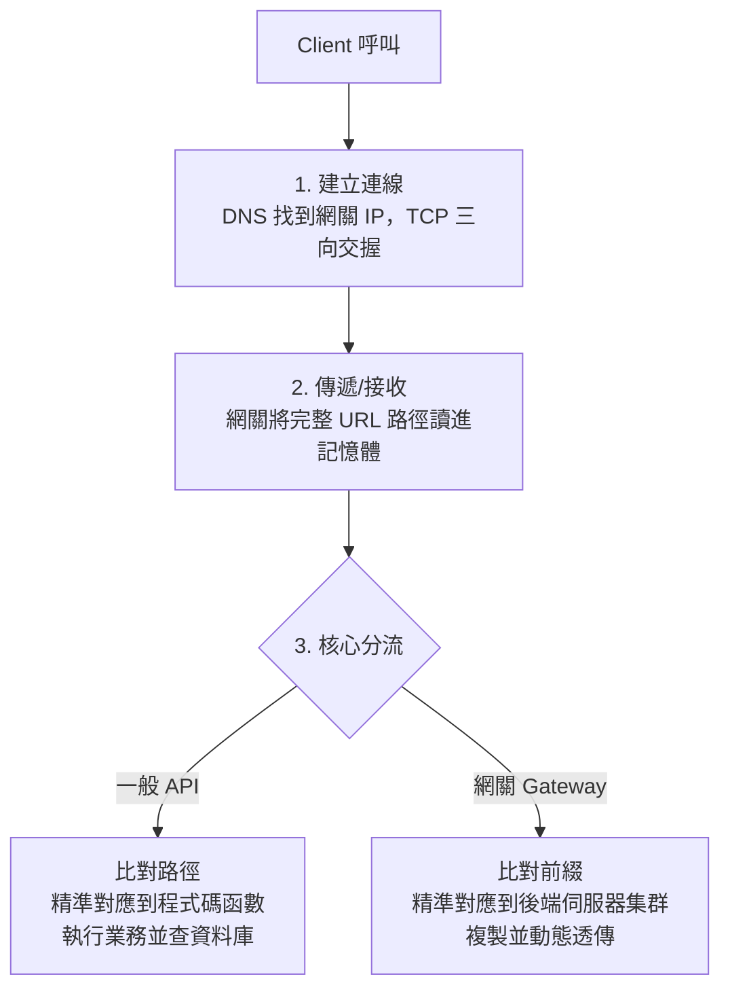

---
{"dg-publish":true,"permalink":"/jet-note/projects/deployment/nginx-api/","title":"Nginx 零耦合 API 網關與藍綠部署實踐","tags":["部署","Nginx","Gateway","Blue-Green","DevOps"],"dg-note-properties":{"title":"Nginx 零耦合 API 網關與藍綠部署實踐","tags":["部署","Nginx","Gateway","Blue-Green","DevOps"],"created":"2026-09-23"}}
---


# Nginx 零耦合 API 網關與藍綠部署實踐

> 核心：網關只認「路徑前綴」認領服務集群，殘餘路徑透傳後端。
> 後端新增再多 API，只要前綴不變，網關永遠不用改 → 零耦合，並順勢取得藍綠部署能力。

---

## 一、核心觀念：網關的「定位接力賽」

### 1. 兩種網關認知

| 面向 | 舊認知（淺層網關 / 強耦合） | 突破（正牌網關 / 完全解耦） |
|------|------------------------------|------------------------------|
| 路由方式 | 一對一：外部 `/users` → 手寫一條轉發到後端 `/users` | 寬鬆入口：開放帶萬用字元的前綴路徑 |
| 後端新增 API | 網關必須同步擴增並重啟 | 只要前綴不變，網關不需改動 |
| 角色定位 | 後端的「影子」 | 服務集群的「入口」 |
| 藍綠部署 | 不可行 | 可行 |

### 2. 定位是接力賽，不是網關一人全包

```
網關階段：只解析路徑「前半段（前綴 / 大方向）」→ 認領服務集群
後端階段：把「後半段殘餘路徑」當字串變數直接透傳 → 由程式碼精準命中函數
```

> 網關不無視規則，而是把「精準尋找位置」拆成兩階段，藉此達到「以不變應萬變」。

---

## 二、請求在 TCP/IP 的傳遞流程

不論一般 API 或網關，底層（TCP/IP）物理流程 100% 相同，差異只在**第 3 步的動作**。



| 步驟 | 一般 API | 網關 (Gateway) |
|------|----------|----------------|
| 3 | 比對**完整路徑** → 程式碼函數 | 比對**前綴** → 後端集群 |
| 結果 | 執行業務邏輯 | 動態透傳請求 |

---

## 三、舊系統搬遷策略（乞丐版升級）

若舊 Client（App / 歷史程式）當初寫死 `IP:Port` 呼叫 API，引進網關時有兩條落地路線。

### 路線 A：直接修改 Client 連線目標

* 將 Client 目標由舊後端改指向 Nginx 網關的 `IP:Port`。
* **架構建議**：趁此把 `IP:Port` 改成域名（如 `http://internal.com`）。
  未來網關換伺服器只需改 DNS，Client 永久免改。

### 路線 B：Client 完全不改，網關原地鳩占鵲巢

* 將原本佔用 `192.168.1.50:8080` 的舊後端移到 `8081`（成為藍環境）。
* 在該台伺服器原地安裝 Nginx，**強佔原本的 8080 Port**。
* Nginx 在後台接收原本流量，依策略轉發給 `8081`（藍）或新伺服器（綠）。

| 路線 | Client 改動 | 效益 |
|------|-------------|------|
| A | 需改連線目標（建議順便改域名） | 一勞永逸、方向清楚 |
| B | 完全不用改 | 已部署的 Client 零改動，瞬間取得藍綠能力 |

---

## 四、大師級架構：map 動態分組路由

為解決「後端多個小專案（微服務）、路徑各異」的問題，採 **map 指令**做「控制面（路由表）與數據面（轉發引擎）分離」。

### 1. 核心網關配置 `nginx.conf`

```nginx
http {
    # 【控制面】自動匹配 Map：用正規表示式 (Regex) 做粗粒度分組
    map $request_uri $backend_service {
        default                     default_cluster;

        ~^/v1/users/                user_service_cluster;    # 歸給用戶服務
        ~^/v1/auth/                 user_service_cluster;

        ~^/v1/products/             product_service_cluster; # 歸給商品服務
        ~^/v1/cart/                 product_service_cluster;
    }

    # 引入各服務獨立的藍綠 Upstream 設定（解耦水閘門）
    include /etc/nginx/conf.d/upstream_user.conf;
    include /etc/nginx/conf.d/upstream_product.conf;

    server {
        listen 8080;   # 監聽 Client 原本呼叫的 Port

        # 【數據面】萬用入口：整個網關只需要這一個 location 區塊
        location / {
            # 動態透傳：proxy_pass 後面直接帶入 map 出來的變數
            proxy_pass http://$backend_service;

            # 優化藍綠切換：強制短連線（讓下一次 Call 重新建立並走入新版環境）
            proxy_set_header Connection "close";
            proxy_set_header Host $host;
            proxy_set_header X-Real-IP $remote_addr;
            proxy_set_header X-Forwarded-For $proxy_add_x_forwarded_for;
            add_header Cache-Control "no-cache, no-store, must-revalidate";
        }
    }
}
```

### 2. 獨立的水閘門控制檔 `/etc/nginx/conf.d/upstream_user.conf`

藍綠部署時**只需修改此檔**，完全不影響其他服務。

```nginx
# 初始狀態：全量在藍環境
upstream user_service_cluster {
    server 192.168.1.51:8080;   # 藍環境（舊版）
    # server 192.168.1.52:8080; # 綠環境（新版）
}
```

---

## 五、藍綠部署標準流程

1. **部署新版**：將新程式碼部署到綠環境（`192.168.1.52:8080`），此時網關流量尚未指過去。
2. **一鍵切流**：以自動化腳本或手動覆寫 `upstream_user.conf`，將 IP 指向綠環境。
3. **無損生效**：在 Nginx 伺服器執行 `sudo nginx -s reload`。
4. **秒級回滾**：若新版有 Bug，將 `upstream_user.conf` 改回藍環境 IP，再次 reload，流量 0.001 秒內拉回舊版。

### Nginx reload 的核心機制（優雅切換 = 排空 + 接力）

* 舊 Worker 不再接受新連線，只把手頭上（in-flight）的請求全部拋轉、回應完畢後才結束。
* 後續新進來的請求，才陸續交由新 Worker 推送到新實例（綠環境）。
* 因此切換期間沒有請求被中途切斷，也沒有停機空窗。

> 注意：這不是金絲雀（按權重/% 漸進分流），而是「新連線一律走新實例，舊連線自然排空」。
> 搭配 `Connection: close` 短連線，reload 後幾乎立即命中新實例；若用 keep-alive，舊連線會黏在舊實例直到關閉。

### 關鍵認知：這是一種策略取捨（止血 vs 不丟棄請求）

若綠版出問題、當下已有 N 個 in-flight 請求，執行 reload 切回藍版後：

* **新請求立刻走藍版**，但那 N 個請求**仍會送到綠版並走完** —— 它們已建立到綠版的 upstream 連線，master 無法收回。
* 舊 Worker 仍持有舊 config，會把這些請求完整回應後才結束。

這**並非無法避免，而是在做取捨**：

| 策略 | 作法 | 代價 |
|------|------|------|
| 優雅 reload（排空） | `nginx -s reload` | N 個請求仍走完錯誤的綠版 |
| 強制止血 | `nginx -s stop` / `kill -9` 舊 worker | 立刻斷掉 N 個請求，client 收到連線中斷 |

兩者互斥：優雅 reload 選的是「不丟棄請求」，代價是無法立刻止血。

補充：可用 `worker_shutdown_timeout` 設上限，避免長請求（大檔上傳、long-polling）無限拖長排空時間、擴大錯誤暴露窗。

```nginx
worker_shutdown_timeout 30s;   # 逾時後強制結束舊 worker
```

---

## 六、設計要點摘要

| 設計 | 作法 | 目的 |
|------|------|------|
| 服務分群 | `map` + Regex 比對前綴 | 控制面與數據面分離，網關零耦合 |
| 動態轉發 | `proxy_pass http://$backend_service` | 整個網關只需一個 `location /` |
| 藍綠隔離 | 每服務獨立 `upstream_*.conf` + `include` | 改一檔不動全局 |
| 切流即時性 | `proxy_set_header Connection "close"` | 短連線，下次 Call 即走新環境 |
| 無快取干擾 | `add_header Cache-Control "no-cache..."` | 避免切流後讀到舊回應 |
| 無損切換 | `nginx -s reload` | 舊 worker 排空 in-flight 請求後才結束，新請求陸續推給新實例 |
| 排空上限 | `worker_shutdown_timeout` | 避免長請求拖長排空、擴大錯誤暴露窗 |
| 止血（取捨） | `nginx -s stop` / `kill -9` | 立刻切斷 in-flight 請求以求立即止血，代價是 client 斷線 |

---

## 相關連結

* [[AgentGateway-AgentBot-技術筆記]] — 應用層 API Gateway（FastEndpoints），對照本文的基礎設施層網關（Nginx）
